 

 
 

## Índice

-   [1. Introdução](#1-introdução)
-   [2. Como utilizar](#2-como-utilizar)
-   [3. Sobre a aplicação](#3-sobre-a-aplicação)
-   [4. Histórias de usuários](#4-histórias-de-usuários)
    -   [Funcionalidades](#gear-funcionalidades)
-   [5. Processo de criação](#5-processo-de-criação)
    -   [Organização](#date-organização)
    -   [Fluxograma](#bulb-fluxograma)
    -   [Wireframe de média fidelidade](#bulb-wireframe-de-média-fidelidade)
    -   [Wireframe de alta fidelidade](#bulb-wireframe-de-alta-fidelidade)
    -   [Identidade visual ](#art-identidade-visual)
    -   [Paleta de cores](#art-paleta-de-cores)
    -   [Logo](#art-logo)
    -   [Testes de usabilidade](#mag_right-testes-de-usabilidade)
-   [6. Desenvolvimento](#6-desenvolvimento)
-   [7. Desenvolvedora](#7-desenvolvedora)

---

## 1. Introdução

O objetivo do projeto era desenvolver uma aplicação <i>SPA</i>(Single-Page Application) para gerenciamento de pedidos, e sincronizar as informações de comandas entre cozinha e salão. Foi desenhada e desenvolvida pensando na usabilidade em tablet.

 </img>

## 2. Como utilizar

✨ Acessar a aplicação [urban bistro](https://urban-bistro.vercel.app/) ✨

É possível acessar a aplicação com **usuário de teste**:

-   Acesso **salão**:

    -   **Email**: salao@urbanbistro.com
    -   **Senha**: teste12345

-   Acesso **cozinha**:

    -   **Email**: cozinha@urbanbistro.com
    -   **Senha**: teste12345

    

## 3. Sobre a aplicação

O restaurante 24 horas <b>urban bistro</b> está crescendo e precisa de uma aplicação que a interface permita os atendentes realizar pedidos utilizando um tablet e enviá-los para a cozinha para que sejam preparados de forma ordenada e eficiente. E que permita que os cozinheiros vejam os pedidos dos clientes, marcar e notificar os atendentes que o pedido está pronto para ser entregue.

## 4. Histórias de usuários

O cliente informou quais eram as histórias de usuário:

-   **HU 01**

    :writing_hand: "Eu como **funcionário** do restaurante quero entrar na plataforma e ver apenas a tela importante para o meu trabalho".

-   **HU 02**

    :writing_hand: "Eu como **atendente** quero anotar pedidos, saber o valor de cada produto e enviar o pedido para a cozinha para ser preparado".

-   **HU 03**

    :writing_hand: "Eu como **chefe de cozinha** quero ver os pedidos dos clientes, marcar e notificar os atendentes que o pedido está pronto para ser entregue".

-   **HU 04**

    :writing_hand: "Eu como **atendente** quero ver os pedidos que estão prontos para entregá-los rapidamente aos clientes".

#### :gear: Funcionalidades

De acordo com as necessidades dos usuários, foram definidas quais funcionalidades deveriam ser implementadas:

-   **HU 01**

    :white_check_mark: Criar login e senha.

    :white_check_mark: Registar tipo de usuário (cozinha / salão), login e senha.

    :white_check_mark: Entrar na tela correta para cada usuário.

-   **HU 02**

    :white_check_mark: Anotar o nome e mesa.

    :white_check_mark: Adicionar produtos aos pedidos.

    :white_check_mark: Excluir produtos.

    :white_check_mark: Ver resumo e o total da compra.

    :white_check_mark: Enviar o pedido para a cozinha.

-   **HU 03**

    :white_check_mark: Ver os pedidos à medida em que são feitos.

    :white_check_mark: Marcar os pedidos que foram preparados e estão prontos para serem servidos.

    :white_check_mark: Ver o tempo que levou para preparar o pedido desde que chegou, até ser marcado como concluído.

-   **HU 04**

    :white_check_mark: Ver a lista de pedidos prontos para servir.

    :white_check_mark: Marque os pedidos que foram entregues.

:exclamation: Ao encerrar o dia as comandas que foram sinalizadas como "entregue" não são exibidas na tela do atendente, porém os dados ficam armazenados para que o restaurante possa levantar estatísticas no futuro.

## 5. Processo de criação

#### :date: Organização

Ao receber o projeto toda a organização de tarefas e processos foram realizadas no <a href="https://trello.com/pt-BR" target="_blank">Trello </a>utilizando o sistema <b>kanban</b> e <b>metodologia ágil</b>. Depois de toda a organização feita, foram definidos os <b>critérios de aceitação e definição de pronto</b>, tempo de realização de cada tarefa e o que seria entregue em cada sprint. <b>Trabalhar integralmente uma história de usuário</b> antes de passar para a próxima, dessa forma ao final de cada sprint o cliente tem acesso ao que está sendo desenvolvido.

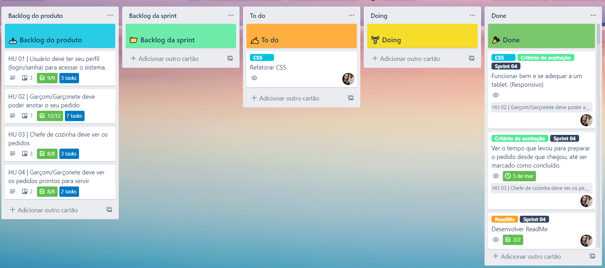

#### :bulb: Fluxograma

Ao entender bem a necessidade do cliente, desenvolvi também fluxogramas para entender qual seria o fluxo do usuário dentro da plataforma.

Abaixo o fluxograma da tela de cadastro e acesso:

  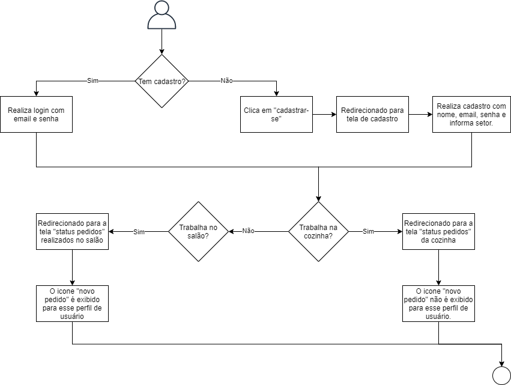

#### :bulb: Wireframe de média fidelidade

Com base nesses dados levantados foi possível desenvolver wireframe de média fidelidade de todas as telas da aplicação tomando cuidado para que fosse uma plataforma tivesse uma experiência de usuário clara e objetiva.

Para desenvolver o wireframe de média fidelidade foi utilizada a ferramenta
<a href="https://mockflow.com/" target="_blank">Mockflow</a>.

  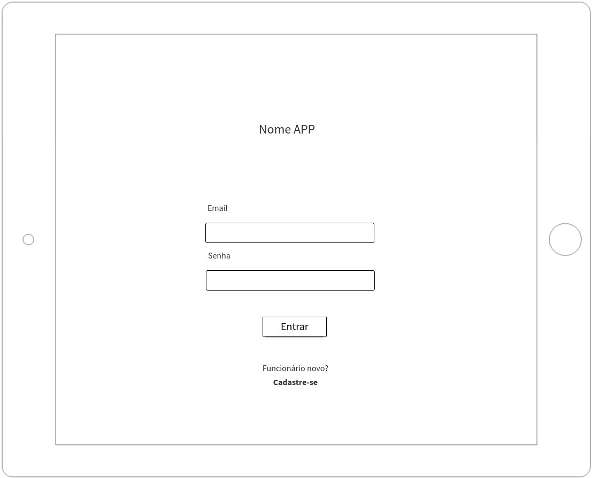 
  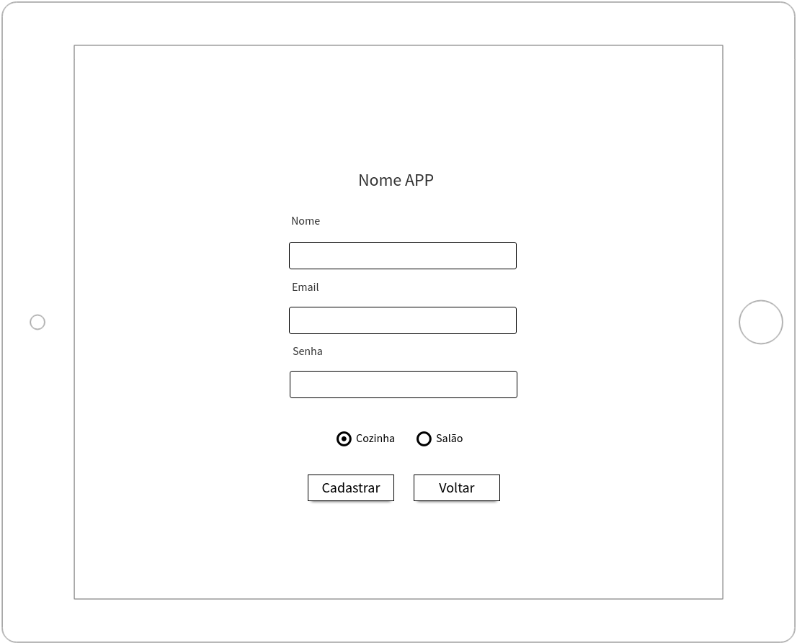 
  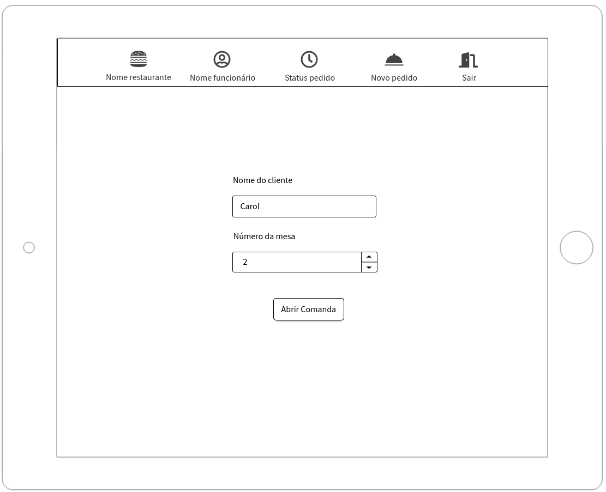 
  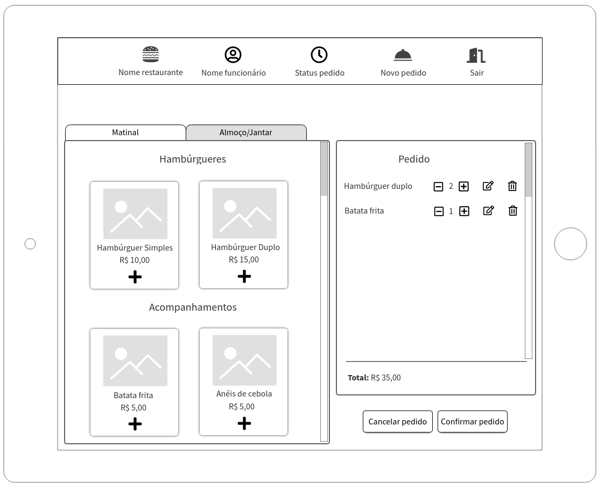 
  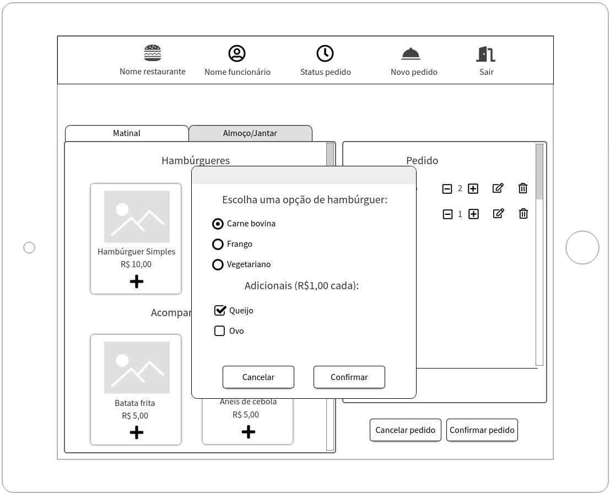 
  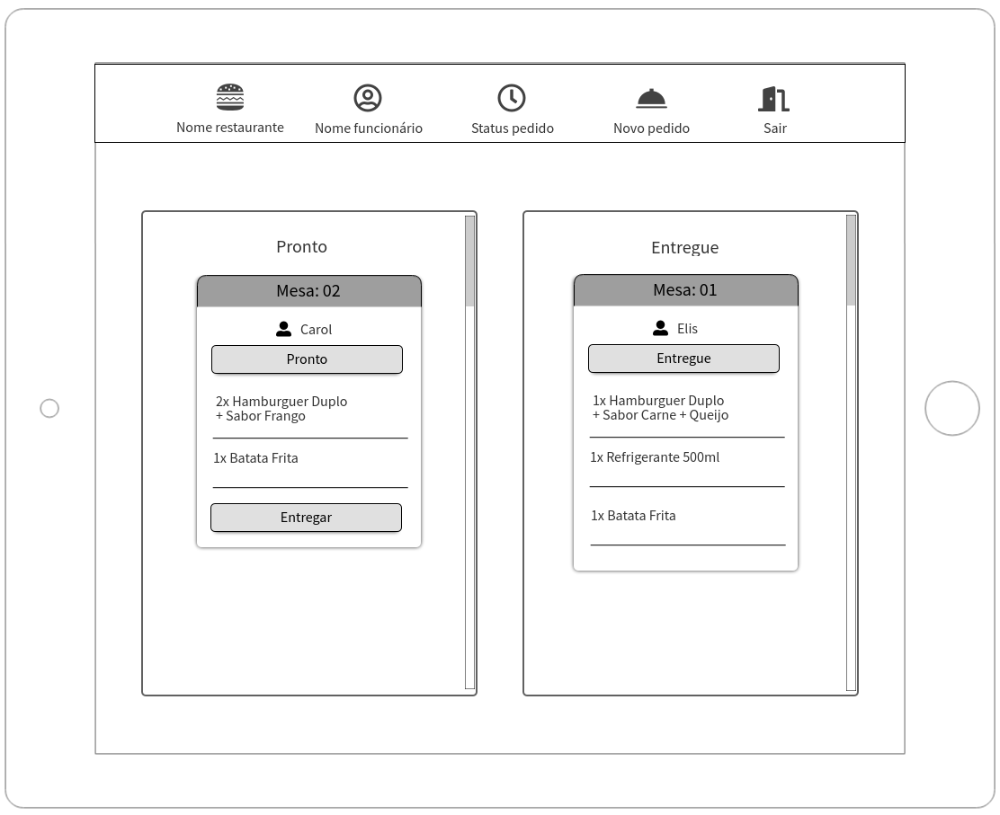 
  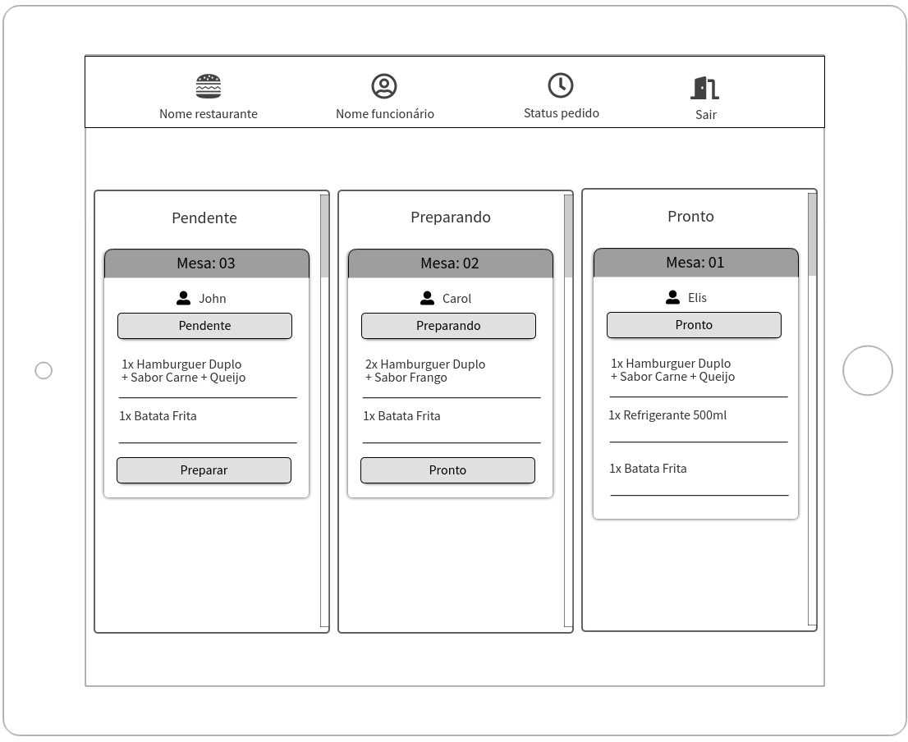 

#### :bulb: Wireframe de alta fidelidade

 Vários detalhes foram pensados para entregar uma aplicação que fosse intuitiva e para melhorar ainda mais a experiência na utilização, nas comandas estão etiquetas sinalizando o status dos pedidos e utilizando o farol como referência foram escolhidas as cores vermelha, laranja e verde.

Para desenvolver o wireframe de alta fidelidade foi utilizada a ferramenta
<a href="https://www.figma.com/" target="_blank">Figma</a>.

 

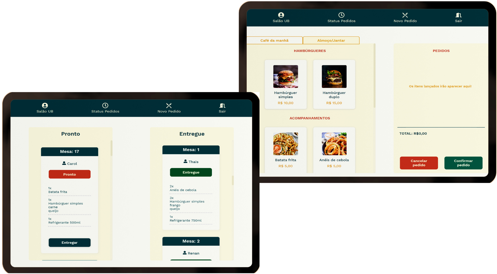

#### :art: Identidade visual

Depois de definir o nome do restaurante que seria o cliente no qual a aplicação seria desenvolvida e algumas pesquisas no google, encontrei um restaurante com o mesmo nome que está localizado na Europa. O perfil era parecido com o que tinha em mente, e o mesmo serviu de inspiração para a paleta de cores e fonte da logo. Se tiver interesse, você pode acessar o site deles <a href="http://urbanbistro.sk/" target="_blank">clicando aqui!</a>

  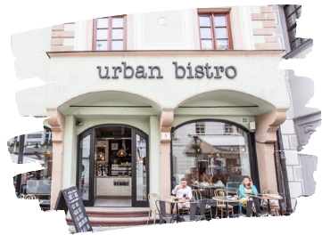

#### :art: Paleta de cores

A paleta de cores foi desenvolvida utilizando o <a href="https://color.adobe.com/" target="_blank">Adobe Color</a>, pensando em tons mais quentes e sofisticados, que estivessem de acordo com o tema, proporcionasse harmonia visual e fosse confortável aos olhos dos usuários.

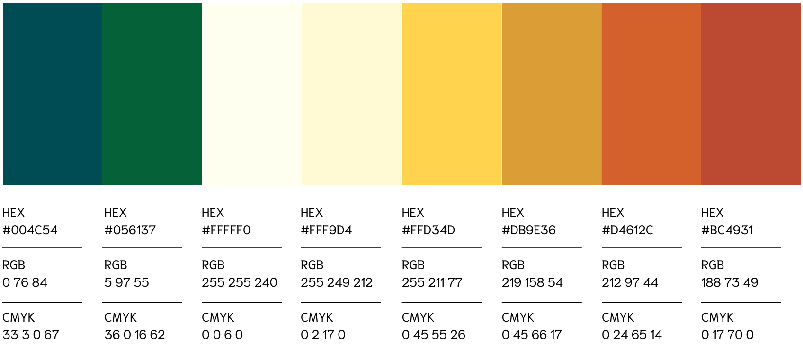

#### :art: Logo

Para a logo foi pensada para que estivesse de acordo com o tema e que fosse capaz de representar a marca. As formas arredondadas acrescentam movimento ao design.

 

 

  <i>
  "Não é o ângulo reto que me atrai, nem a linha reta, dura, inflexível   criada pelo homem. O que me atrai é a curva livre e sensual, a curva que  encontro no curso sinuoso dos nossos rios, nas nuvens do céu, no corpo da  mulher preferida. De curvas é feito todo o universo, o universo curvo de   Einstein".
  </i> Assim já dizia o renomado arquiteto Oscar Niemeyer.

#### :mag_right: Testes de usabilidade

Foram realizados testes com algumas das pessoas que se dispuseram testar a usabilidade durante o processo de desenvolvimento. Com isso foi possível levantar dados que ajudaram a melhorar a aplicação:

⚠️ Os usuários apontaram que não sentiam necessidade do ícone :heavy_plus_sign: no card dos produtos que fazem parte do menu pois já estava claro que ao clicar os itens seriam adicionados na comanda.

✔️ Como solução o ícone foi removido e o card ficou melhor e mais agradável visualmente.

⚠️ Os usuários não estavam satisfeitos com a paleta de cores que estava sendo utilizada inicialmente e apontaram que as cores escuras estavam afetando a utilização

✔️ Foi desenvolvida uma nova paleta de cores tomando cuidado para que não fosse escura e não sobrecarregasse o olhar do usuário.

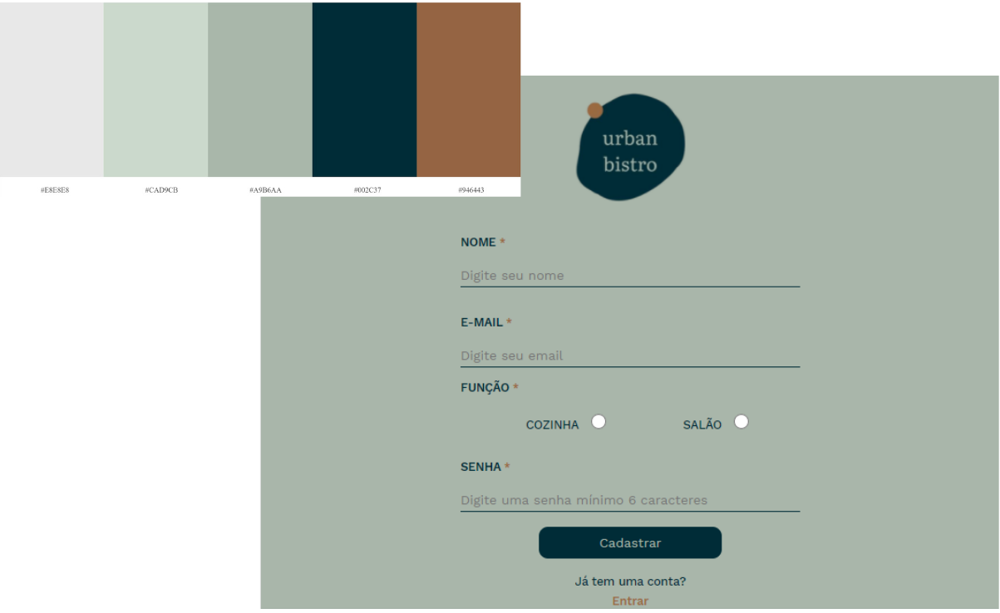

## 6. Desenvolvimento

:gear: Para esse projeto foram usados:

-   HTML5
-   CSS3
-   JavaScript(ES6+)
-   JSX
-   ReactJS
-   Vercel

## 7. Desenvolvedora

:mailbox: Entre em contado com a desenvolvedora **Caroline Costa**:

:pushpin: [GitHub](https://github.com/CarolineSCosta)

:pushpin: [LinkedIn](https://www.linkedin.com/in/carolinescosta/)

 </img>

Esse projeto foi desenvolvido no <a href="https://www.laboratoria.la/br" target="_blank">Bootcamp da Laboratória Brasil</a>

